# SFX Desk

Always-on-top desktop SFX generator for **DaVinci Resolve** (free or Studio).

**Local GPU in. Media Pool out.** Generate on your NVIDIA box, audition in the floating desk, **Send** straight into a Resolve bin - no cloud plugin, no browser download, no drag-from-Downloads. Built for editors who want AI SFX without leaving the cut.

Cloud-in-Resolve SFX panels exist (Mirelo, Kolbo, stock libraries). This is the other lane: **offline-capable local gen + companion UI + scripting Send**, MIT, free Resolve friendly.

**Free and open source (MIT).** No price tag. If you want to support development:

> **Donate (PayPal):** https://www.paypal.com/donate/?business=B8KD4347C4F9L&no_recurring=0&currency_code=CAD

## Requirements

- **OS:** Windows
- **GPU:** **NVIDIA** with a recent driver (CUDA). This is the only supported path for v1.
- **Not supported:** AMD GPUs, Intel Arc, Mac, CPU-only (too slow for the engines we ship).

SA3 Small-SFX is the daily driver (~2-4 GB VRAM). MOSS is optional and wants ~16 GB+ (see Engines below).

---

## Example sounds

Local SA3 gens from this desk (playable on GitHub):

| Type | Listen |
|------|--------|
| Riser | <audio controls src="docs/examples/riser.mp3"></audio> |
| Swoosh | <audio controls src="docs/examples/swoosh.mp3"></audio> |
| Hit | <audio controls src="docs/examples/hit.mp3"></audio> |
| Rumble | <audio controls src="docs/examples/rumble.mp3"></audio> |
| Faller | <audio controls src="docs/examples/faller.mp3"></audio> |
| Ambience | <audio controls src="docs/examples/ambience.mp3"></audio> |

Direct links: [riser](docs/examples/riser.mp3) · [swoosh](docs/examples/swoosh.mp3) · [hit](docs/examples/hit.mp3) · [rumble](docs/examples/rumble.mp3) · [faller](docs/examples/faller.mp3) · [ambience](docs/examples/ambience.mp3)

---

## Screenshots

Always-on-top companion over DaVinci Resolve - generate, audition, then **Send** into the Media Pool bin SFX Desk (bin only, no timeline drop).

### In Resolve

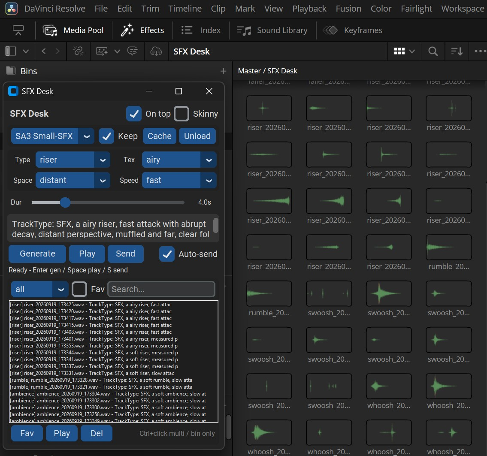

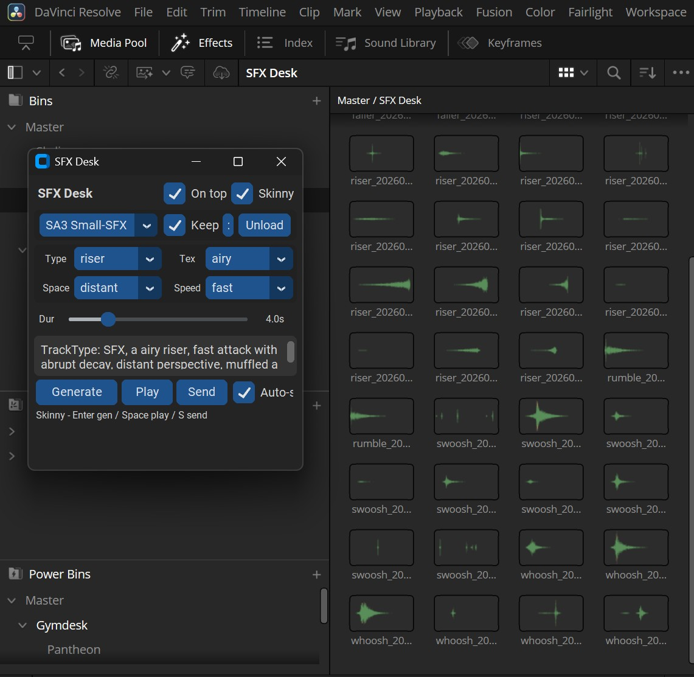

### App window

| Full | Skinny |
|------|--------|
| 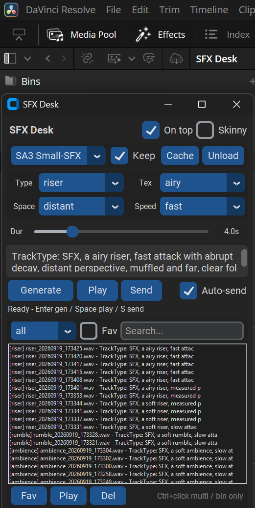 | 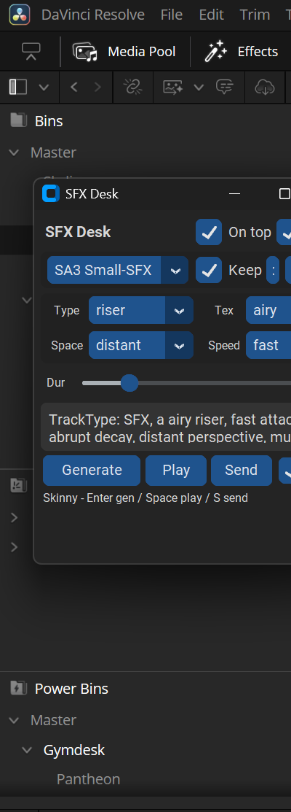 |

### Prompt builder

Type / texture / space / speed drive the prompt; duration sets length. Hotkeys: **Enter** generate, **Space** play, **S** send.

| Type | Texture | Space | Speed |
|------|---------|-------|-------|
| 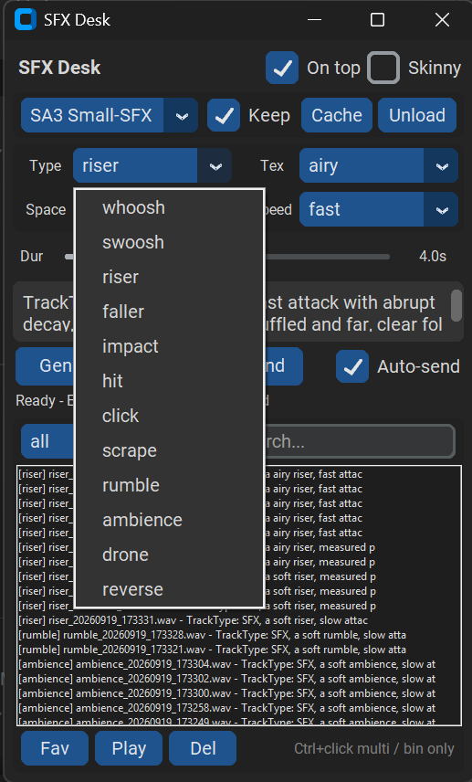 | 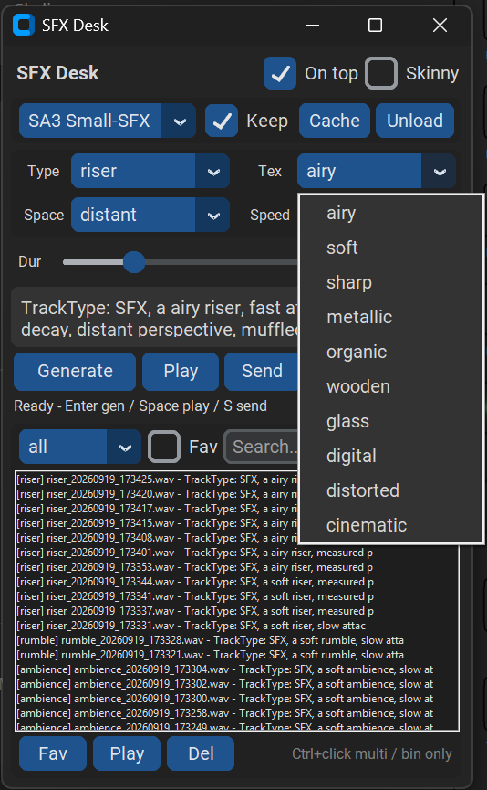 | 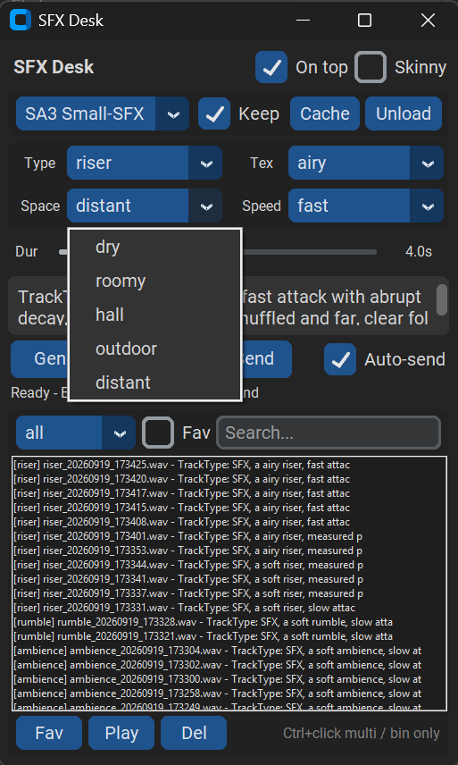 | 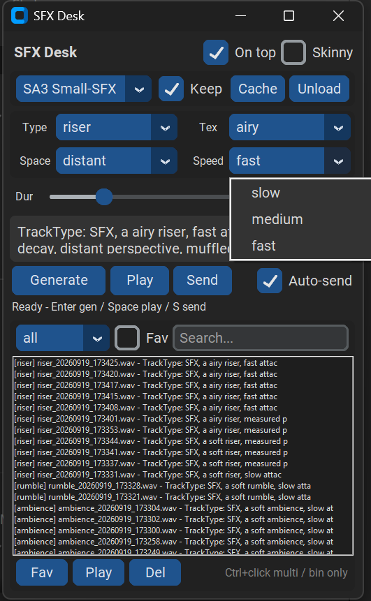 |

### UI pieces

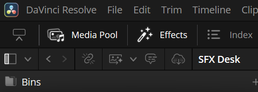

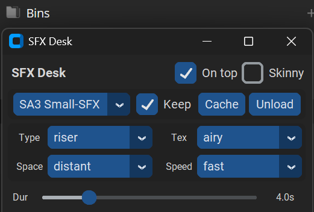

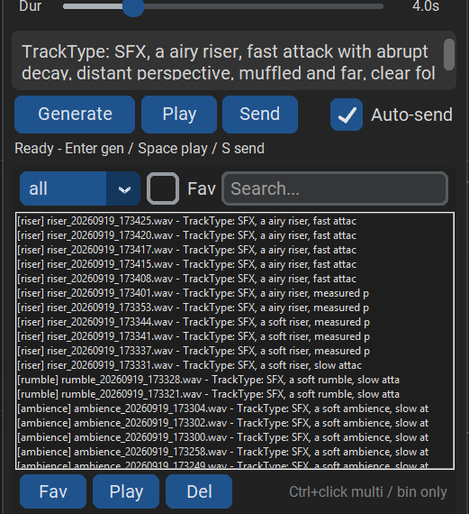

---

## Quick start (Windows)

1. Install [Python 3.12](https://www.python.org/downloads/) (check **Add to PATH**).
2. Clone this repo.
3. Double-click **`scripts\setup_windows.bat`**  
   - Creates `.venv`  
   - Installs PyTorch CUDA + SA3  
   - Opens the SA3 license page  
   - Runs **`hf auth login`** — prefer the **browser** option, or paste a **read** token from [HF tokens](https://huggingface.co/settings/tokens)  
   - Use **your** Hugging Face account. Never commit a token.
4. Accept the gated model license:  
   https://huggingface.co/stabilityai/stable-audio-3-small-sfx
5. Launch with **`scripts\run_windows.bat`**

More detail: [SETUP.md](SETUP.md)

---

## Engines

| Engine | VRAM | Role |
|--------|------|------|
| **SA3 Small-SFX** (default) | ~2–4 GB | Daily driver — fine with Resolve open |
| **MOSS-SoundEffect v2** | ~13–14 GB alone | Optional quality; see VRAM rules |

### MOSS VRAM (plain English)

- **Under 16 GB:** MOSS locked (optional **Force MOSS**). Use SA3.
- **~16 GB:** Close Resolve → generate → **Unload** → open Resolve → **Send**.
- **~20–24 GB:** Comfortable with Resolve open + MOSS kept loaded.

---

## Resolve Send

Works on **free Resolve and Studio**.  
Preferences → System → General → **External scripting: Local**.  
Imports into Media Pool bin `SFX Desk` only (no timeline drop). Multi-select supported.

---

## What this repo does *not* include

- Your Hugging Face token  
- Downloaded model weights  
- Local library / WAVs / `settings.json`  
- A paid unlock  

Everyone brings their own HF account and accepts Stability’s license themselves.

---

## License

MIT — see [LICENSE](LICENSE).  
Third-party models (SA3, MOSS) have their **own** licenses; you must accept those on Hugging Face.

